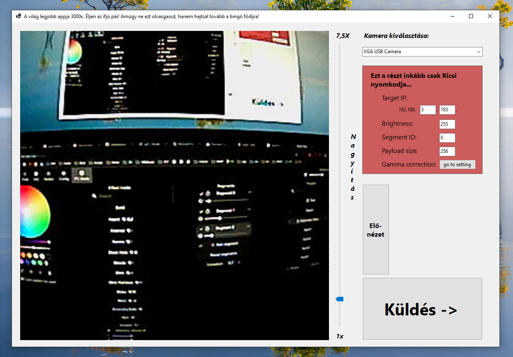
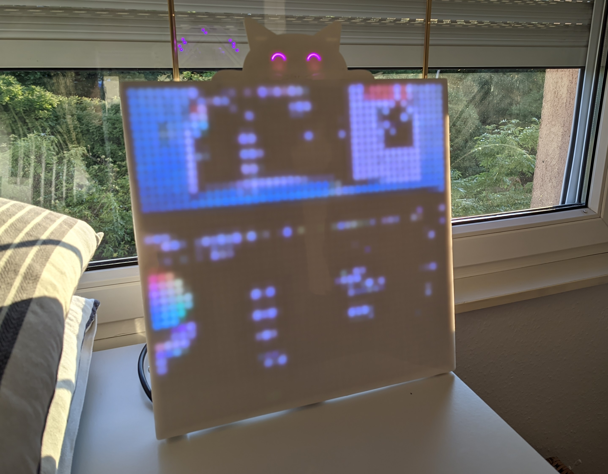

# WLED Camera Application

This prototype desktop application lets you interface directly with webcams connected to your system. It lists all available webcams, provides a live preview feed, and allows you to set a target IP address. Once configured, the app captures a snapshot, downscales it to a specified resolution, and sends the image data in a format compatible with WLED lighting systems.

The current implementation is tailored for a personal [WLED](https://github.com/wled/WLED)
 display project, and includes some interface elements in Hungarian. I made this as a gimmick for my wedding.

**Note:** This is a working prototype and not a finalized product. If there is interest, the app may be developed further to support more generic configurations and use cases.

# Example images

### The app

### The device

